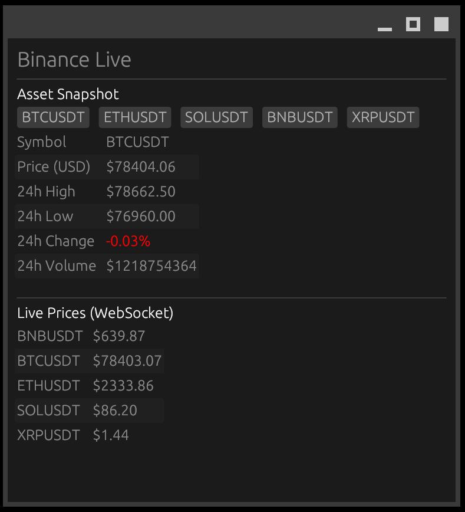
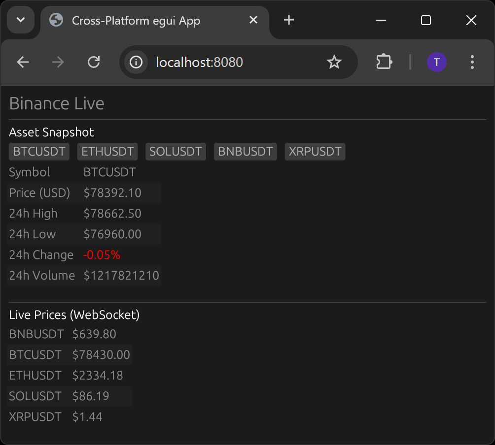
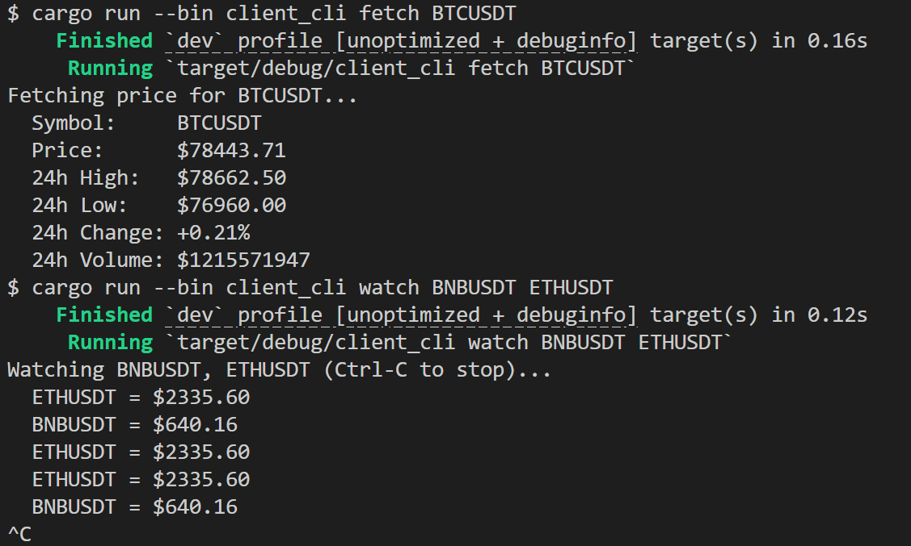

# egui-arch
<p>
	
	
	
</p>

Architecture to reuse logic across three frontends, each running as a self-contained application.

- a Desktop GUI
- a Browser GUI
- a CLI

Each frontend does REST calls or watches changes using WebSockets.


## Crates

| Crate         | description                                          |
| ------------- | ---------------------------------------------------- |
| `client_core` | shared core, x-platform impl (REST + WebSockets)     |
| `client_gui`  | GUI for Desktop or Browser platform (eGUI),          |
| `client_cli`  | CLI                                                  |

hint: GUI is only tested on WSL2 & Web.

## Use

```bash
# CLI
cargo run --bin client_cli
cargo run --bin client_cli fetch BTCUSDT         # REST
cargo run --bin client_cli watch BTCUSDT ETHUSDT # WebSockets

# Desktop GUI
cargo run --bin client_gui

# Browser GUI
cargo install trunk # build static webpage & web server
(cd client_gui && trunk serve)
```
